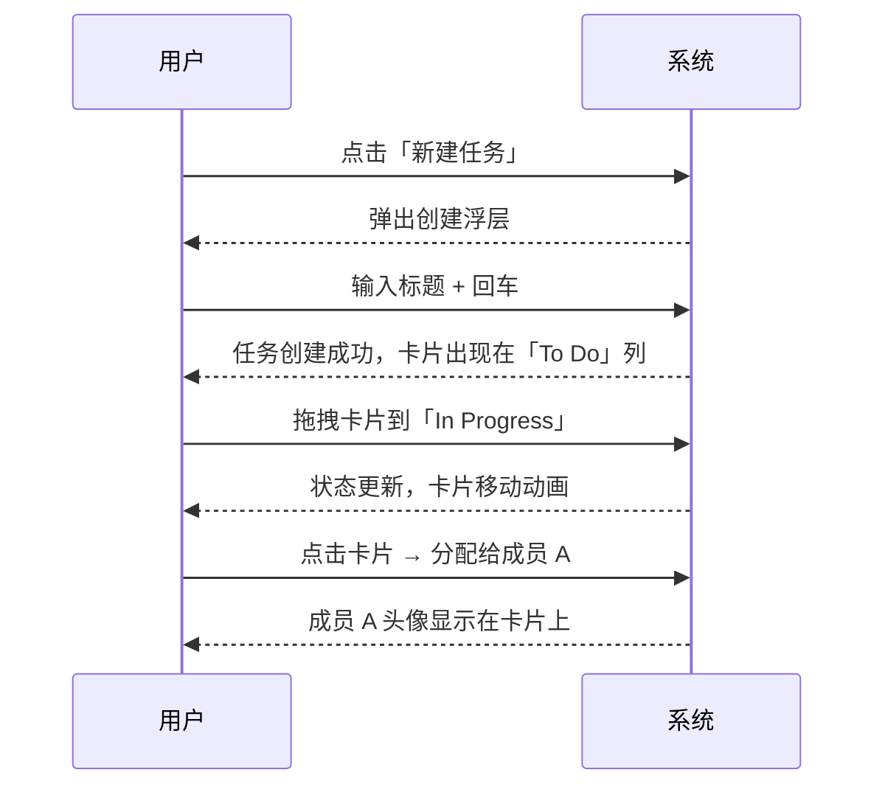

# PRD（可执行版）: TaskFlow Pro

## 文档归属说明

| 属性 | 内容 |
| :--- | :--- |
| **项目名称** | TaskFlow Pro |
| **文档版本** | v1.0.0（Stable） |
| **负责人** | Alice |
| **最后更新** | 2026-04-16 |
| **状态** | Planning |
| **适用对象** | 研发, 设计, 运营 |

---

## 一、需求背景及分析（Why）

### 1.1 现状与机会
*   **现状痛点：** 中小团队任务管理工具要么功能过剩（Jira 类），要么功能单薄（Todo 类）。用户在「功能复杂度」和「上手成本」之间被迫二选一。
*   **机会点：** 远程办公常态化后，团队需要一个「轻量但有结构」的任务协作工具——既能承载复杂项目，又不让新成员望而却步。
*   **核心假设：** 如果提供一个「渐进式复杂度」的任务管理工具（简单任务一键创建，复杂任务可展开子任务/依赖/时间线），用户留存率将提升 30%。

### 1.2 目标用户（不写 Persona 列表，写 Mental State）
*   **目标用户是谁：** 5-20 人的产品/研发团队负责人，需要追踪团队任务进度。
*   **用户当前心智：** 焦虑（担心任务遗漏）、赶时间（没空学习复杂工具）、求稳（不敢换工具怕数据迁移成本）。
*   **触发场景：** 晨会后需要分配任务、周五需要查看下周计划、老板突然问「这个项目进度怎么样」。

### 1.3 体验目标（Alice 必填）
*   **情绪目标（Emotion Goal）：** 让用户感到「掌控」——一眼就知道团队在做什么，心里有底。
*   **核心隐喻（Metaphor）：** 「透明指挥舱」——像坐在驾驶舱里看仪表盘，所有状态一目了然，但操作只需要点几个按钮。
*   **成功瞬间（Aha Moment）：** 用户第一次拖拽任务卡片，看到状态实时更新 + 团队成员头像闪烁，意识到「原来协作可以这么顺」。

---

## 二、目标与范围（What）

### 2.1 成功标准（可验收）

| 类别 | 指标/标准 | 口径 | 目标值 |
| :--- | :--- | :--- | :--- |
| **OMTM** | 7 日留存率 | 注册后 7 天内至少登录 3 次的用户占比 | ≥40% |
| **Guardrails** | 任务创建平均耗时 | 从点击「新建」到任务创建完成的时间 | ≤15 秒 |
| **质量** | 首屏加载时间 | 白屏到内容渲染完成 | ≤1.5 秒 |

### 2.2 交付物清单（必须落地到文件/链接）
*   **PRD**：`Source/TaskFlow_Pro/input/prd(input).md`
*   **Brand DNA**：`Source/TaskFlow_Pro/input/brand_dna.md`
*   **Design Tokens**：`Source/TaskFlow_Pro/tokens.json`
*   **设计资产**：style/specs/motion/skeleton/payload
*   **代码交付**：`projects/TaskFlow_Pro/`

### 2.3 范围（Scope）
*   **In Scope：**
    - 任务创建/编辑/删除/归档
    - 看板视图（To Do / In Progress / Done）
    - 任务分配（单人/多人）
    - 截止日期设置 + 过期提醒
    - 团队成员管理
*   **Out of Scope：**
    - Gantt 图（v2 迭代）
    - 时间追踪/Timesheet（v2 迭代）
    - 外部集成（Slack/钉钉/飞书）（v2 迭代）

### 2.4 终端与适配（必须明确）
*   **主终端：** Web（桌面端为主战场）
*   **分辨率/断点：** 最小 1280×720，优化 1440×900
*   **首要动作（Primary Action）：** 创建任务
*   **信息密度目标：** 中（需要展示足够信息但不拥挤）

#### 2.4.1 Web 附录（必填字段 + 示例）
*   **断点策略：** >=1440 完整布局，>=1280 压缩侧边栏，<1280 提示「请使用更大屏幕」
*   **布局栅格：** 12 栅格，max-w-7xl，gutter 24px
*   **交互密度：** 信息密度中，hover 显示详情浮层，不强依赖 hover
*   **性能预算：** 首屏图片 ≤ 200KB，总 JS ≤ 200KB（gzipped）
*   **无障碍最低线：** 键盘可达（Tab 导航）、焦点可见、对比度 ≥4.5:1

示例：
*   分辨率：Web 1440 为主，1280 次级；小于 1280 提示横屏或更大屏幕。

---

## 三、需求清单（Feature List）

| 模块 | 功能点 | 优先级 | 用户价值 | 验收标准（一句话） |
| :--- | :--- | :--- | :--- | :--- |
| **任务管理** | 创建任务 | P0 | 快速记录待办 | 输入标题 + 回车即可创建，≤3 步 |
| **任务管理** | 编辑任务 | P0 | 修正/补充信息 | 点击任务卡片 → 弹窗编辑 → 保存生效 |
| **任务管理** | 删除任务 | P0 | 清理无效任务 | 确认弹窗 → 删除 → 从看板消失 |
| **任务管理** | 任务状态切换 | P0 | 反映进度 | 拖拽卡片到目标列 → 状态更新 → 动画反馈 |
| **团队协作** | 任务分配 | P0 | 明确责任人 | 点击「指派」→ 选择成员 → 头像显示在卡片上 |
| **团队协作** | 成员管理 | P1 | 团队成员增删 | 设置页邀请/移除成员，实时生效 |
| **提醒** | 过期提醒 | P1 | 防止遗漏 | 任务过期时红色标记 + 浏览器通知 |

---

## 四、核心流程与交互（How）

### 4.1 核心用户流程（Mermaid）

### 4.2 关键页面/状态（必须覆盖）
*   **入口页/首屏**：看板视图（三列布局：To Do / In Progress / Done），顶部工具栏（新建任务、筛选、搜索），左侧团队列表。
*   **主流程页**：任务详情弹窗（标题、描述、负责人、截止日期、评论）。
*   **空态/加载态/错误态**：
    - 空态：「还没有任务？点击新建第一个任务吧」+ 气球插图
    - 加载态：骨架屏（三列卡片轮廓）
    - 错误态：「加载失败，点击重试」+ 刷新按钮

### 4.3 功能详解（按模块）

#### 4.3.1 任务创建
*   **用户任务：** 快速创建一个新任务。
*   **功能入口：** 顶部工具栏「+ 新建任务」按钮 / 看板列头「+」图标。
*   **输入/输出：** 标题（必填）→ 任务卡片出现在对应列。
*   **交互规则：**
    - 标题输入框聚焦，回车直接创建
    - 可选：描述、负责人、截止日期（展开「更多选项」）
*   **异常与降级：** 标题为空时禁用「创建」按钮，提示「请输入任务标题」。
*   **验收标准：** 从点击到创建完成 ≤3 步，耗时 ≤10 秒。

#### 4.3.2 任务状态切换
*   **用户任务：** 更新任务进度。
*   **功能入口：** 拖拽任务卡片到目标列。
*   **输入/输出：** 拖拽位置 → 任务状态字段更新 → 卡片在新位置渲染。
*   **交互规则：**
    - 拖拽时卡片半透明，目标列高亮
    - 释放后卡片动画吸附到目标位置
    - 同步更新「最近修改」时间戳
*   **异常与降级：** 网络失败时显示「同步中」状态，成功后自动消失。
*   **验收标准：** 拖拽响应 <100ms，动画流畅（60fps）。

---

## 五、约束与依赖（Constraints）

### 5.1 设计与一致性约束
*   **Design Tokens 引用：** `Source/TaskFlow_Pro/tokens.json`
*   **视觉基调：** 从 Brand DNA 引用 3 个关键词：**清晰、高效、可信赖**
*   **反例约束：** 避免使用过多颜色区分状态（不超过 5 种状态色），避免卡片阴影过重

### 5.2 技术与实现约束
*   **技术栈：** React 18 + TypeScript + Tailwind CSS
*   **兼容性：** Chrome 90+, Safari 14+, Firefox 88+, Edge 90+
*   **禁止项：** 不使用 jQuery、不使用重度状态管理库（如 Redux），优先用 Zustand

---

## 六、人类决策点（Stop Conditions / 必须追问）

当出现以下任意情况，禁止猜测执行，必须向用户追问并等待确认：
1.  **情绪目标缺失** 或 与隐喻冲突 —— 本例已明确「掌控感」+「指挥舱」
2.  **主终端/首要动作不明确** —— 本例已明确 Web + 创建任务
3.  **成功标准无法验收** —— 本例已定义 OMTM + Guardrails + 质量
4.  **范围冲突** —— 本例 In/Out Scope 已明确
5.  **关键约束缺失** —— 本例已定义技术栈 + 兼容性

---

## 七、数据与埋点（如适用）

| 事件名称 | 触发条件 | 记录属性 | 分析目的 |
| :--- | :--- | :--- | :--- |
| `task_created` | 任务创建成功 | task_id, creator_id, column | 分析任务创建频率 |
| `task_moved` | 任务状态切换 | task_id, from_column, to_column | 分析任务流转效率 |
| `task_assigned` | 任务分配 | task_id, assignee_id | 分析团队协作模式 |

---

## 八、发布与验证（如适用）

### 8.1 发布策略
*   **Alpha**：2026-05-01，内部团队 10 人，风险控制：每日备份数据
*   **Beta**：2026-05-15，邀请 100 位种子用户，风险控制：每周数据快照
*   **GA**：2026-06-01，全量开放

### 8.2 验证清单
*   **功能验收**：任务 CRUD 完整可用，状态切换流畅，分配功能正常
*   **体验验收**：用户反馈「界面清爽」「操作顺畅」，达到情绪目标「掌控感」
*   **Reviewer**：Visual Reviewer 通过条件：配色不超过 5 色，间距一致性达标

---

**附件：**
*   Brand DNA 文档（待生成）
*   设计稿链接（待设计）
