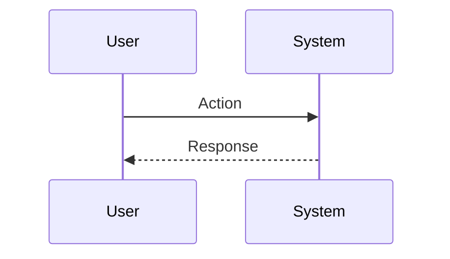

# PRD（可执行版）: [Project Name]

> **完整性检查**：提交前确认以下必填段已填写：
> - [ ] 1.2 目标用户（Mental State 三要素）
> - [ ] 1.3 体验目标（情绪目标 + 核心隐喻 + 成功瞬间）
> - [ ] 2.1 成功标准（至少 1 个 OMTM + 口径 + 目标值）
> - [ ] 2.4 主终端 + 首要动作
> - [ ] 三、需求清单（至少 1 个 P0 功能）
> - [ ] 六、Stop Conditions 判断结果

## 文档归属说明

| 属性 | 内容 |
| :--- | :--- |
| **项目名称** | [Project Name] |
| **文档版本** | v1.0.0（Draft/Stable） |
| **负责人** | [Owner Name] |
| **最后更新** | [Date] |
| **状态** | [Planning/In-Progress/Done] |
| **适用对象** | 研发 / 设计 / 运营 |

---

## 一、需求背景及分析（Why）

### 1.1 现状与机会
*   **现状痛点：** [问题描述 + 影响范围]
*   **机会点：** [为什么现在做，窗口期是什么]
*   **核心假设：** [If X → Then Y（可验证）]

### 1.2 目标用户（不写 Persona 列表，写 Mental State）
*   **目标用户是谁：** [一句话]
*   **用户当前心智：** [焦虑/赶时间/探索/求稳…]
*   **触发场景：** [什么时候会打开/点击/使用]

### 1.3 体验目标（Alice 必填）
*   **情绪目标（Emotion Goal）：** [让用户感觉到什么：安全/掌控/轻盈/兴奋…]
*   **核心隐喻（Metaphor）：** [用现实世界隐喻解释产品：例如“控制台/驾驶舱/实验台”]
*   **成功瞬间（Aha Moment）：** [哪一刻用户会觉得“值了”】【触发条件】]

---

## 二、目标与范围（What）

### 2.1 成功标准（可验收）

| 类别 | 指标/标准 | 口径 | 目标值 |
| :--- | :--- | :--- | :--- |
| **OMTM** | [核心指标] | [如何计算] | [目标] |
| **Guardrails** | [不牺牲的指标] | [口径] | [阈值] |
| **质量** | [性能/稳定/准确] | [口径] | [目标] |

**口径示例**：
- 「7 日留存率」= 注册后第 7 天仍活跃的用户数 / 注册用户总数
- 「首屏加载时间」= 从请求发起到首屏内容渲染完成（FCP）的时间
- 「任务创建耗时」= 从点击「新建」到任务保存成功的时间

### 2.2 交付物清单（必须落地到文件/链接）
*   **PRD**：`Source/[Name]/input/prd(input).md`
*   **Brand DNA**：`Source/[Name]/input/brand_dna.md`（如适用）
*   **Design Tokens**：`tokens.json`（如适用）
*   **设计资产**：style/specs/motion/skeleton/payload（如适用）
*   **代码交付**：`projects/[Name]/`（如适用）

### 2.3 范围（Scope）
*   **In Scope：** [本次必须做的事情]
*   **Out of Scope：** [本次明确不做，避免暗示]

### 2.4 终端与适配（必须明确）
*   **主终端：** [Web / Mobile / Landing / Desktop]（单选，明确主战场）
*   **分辨率/断点：** [例如：Mobile 390 / Web 1440 / Desktop 最小 1024]
*   **首要动作（Primary Action）：** [CTA/核心任务]
*   **信息密度目标：** [低/中/高 + 原因]

#### 2.4.1 Web 附录（必填字段 + 示例）
*   **断点策略：** [例如：>=1440 桌面，>=1024 笔记本，>=768 平板，<768 移动端降级]
*   **布局栅格：** [例如：12 栅格 / max-w-6xl / gutter 24]
*   **交互密度：** [例如：信息密度中，hover 丰富但不强依赖 hover 完成交互]
*   **性能预算：** [例如：首屏图片 ≤ 500KB，总 JS ≤ 300KB（示例）]
*   **无障碍最低线：** [键盘可达/焦点可见/对比度达标]

示例（可删改）：
*   分辨率：Web 1440 为主，1024 次级；移动端只保证可读与关键 CTA。

#### 2.4.2 Mobile 附录（必填字段 + 示例）
*   **目标机型/尺寸：** [例如：iPhone 390×844 / Android 360×800]
*   **手势与触达：** [主 CTA 位于拇指热区；滑动/长按是否存在]
*   **信息折叠策略：** [卡片折叠/分步/渐进披露]
*   **动效策略：** [少量关键动效，避免影响性能与可用性]
*   **弱网与离线：** [弱网加载策略/占位/重试]

示例（可删改）：
*   主流程拆成 3 步以内；每步只允许 1 个主动作（Primary Action）。

#### 2.4.3 Landing 附录（必填字段 + 示例）
*   **首屏目标：** [一句话价值主张 + 1 个主 CTA]
*   **信息层级：** [首屏/证据区/功能区/FAQ/页尾]
*   **转化路径：** [CTA → 表单/联系/下载/跳转]
*   **信任证据：** [Logo、数据、案例、对比、背书]
*   **A/B 变量：** [CTA 文案/主视觉/首屏结构（可选）]

示例（可删改）：
*   首屏只回答 3 个问题：我是谁/我解决什么/下一步做什么。

#### 2.4.4 Desktop 附录（必填字段 + 示例）
*   **窗口尺寸策略：** [最小窗口尺寸、默认窗口尺寸、最大窗口尺寸]
*   **多窗口支持：** [是否支持多窗口实例、窗口间状态同步策略]
*   **系统托盘/菜单栏：** [最小化行为、常驻图标、快捷操作]
*   **快捷键体系：** [全局快捷键、应用内快捷键、与系统快捷键冲突处理]
*   **更新机制：** [自动更新/手动更新、更新提示策略、版本检查频率]
*   **离线能力：** [核心功能离线可用性、数据同步策略、冲突处理]

示例（可删改）：
*   最小窗口 1024×640，默认 1280×800，支持全屏与窗口化切换；核心功能离线可用，数据下次联网自动同步。

---

## 三、需求清单（Feature List）

| 模块 | 功能点 | 优先级 | 用户价值 | 验收标准（一句话） |
| :--- | :--- | :--- | :--- | :--- |
| **[Module]** | [Feature] | P0/P1 | [Value] | [Acceptance] |
| **[Module]** | [Feature] | P0/P1 | [Value] | [Acceptance] |

---

## 四、核心流程与交互（How）

### 4.1 核心用户流程（Mermaid）

### 4.2 关键页面/状态（必须覆盖）
*   **入口页/首屏**： [信息结构 + 关键内容]
*   **主流程页**： [步骤/表单/编辑/预览…]
*   **空态/加载态/错误态**： [每个状态怎么呈现 + 用户能做什么]

### 4.3 功能详解（按模块）

#### 4.3.1 [功能名称]
*   **用户任务：** [用户想完成什么]
*   **功能入口：** [从哪里触发]
*   **输入/输出：** [Inputs → Outputs]
*   **交互规则：** [if X -> do Y（避免模糊叙事）]
*   **异常与降级：** [失败怎么提示/怎么恢复]
*   **验收标准：** [可测试的条件]

---

## 五、约束与依赖（Constraints）

### 5.1 设计与一致性约束
*   **Design Tokens 引用：** [tokens.json 路径/规则]
*   **视觉基调：** [从 Brand DNA 引用 3 个关键词]
*   **反例约束：** [Bad_Patterns.md 中禁止项（如有）]

### 5.2 技术与实现约束
*   **技术栈：** [例如 React + TS + Tailwind]
*   **兼容性：** [浏览器/设备/性能预算]
*   **禁止项：** [不可引入的库/不可用的能力]

---

## 六、人类决策点（Stop Conditions / 必须追问）

当出现以下任意情况，禁止猜测执行，必须向用户追问并等待确认：
1.  **情绪目标缺失** 或 与隐喻冲突
2.  **主终端/首要动作不明确**
3.  **成功标准无法验收**（没有口径/没有目标值）
4.  **范围冲突**（In/Out Scope 含糊或互相打架）
5.  **关键约束缺失**（必须遵循 tokens/规范但未提供路径或规则）

---

## 七、数据与埋点（如适用）

| 事件名称 | 触发条件 | 记录属性 | 分析目的 |
| :--- | :--- | :--- | :--- |
| `event_name` | [Trigger] | [Properties] | [Why] |

---

## 八、发布与验证（如适用）

### 8.1 发布策略
*   **Alpha/Beta/GA**： [时间 + 人群 + 风险控制]

### 8.2 验证清单
*   **功能验收**： [P0 验收点列表]
*   **体验验收**： [是否达到情绪目标/是否出现 Aha Moment]
*   **Reviewer**： [Visual/Interaction Reviewer 的通过条件（如有）]

---

**附件：**
*   [Link to File]
