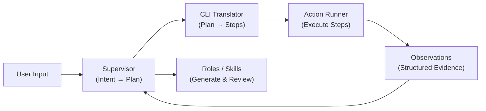
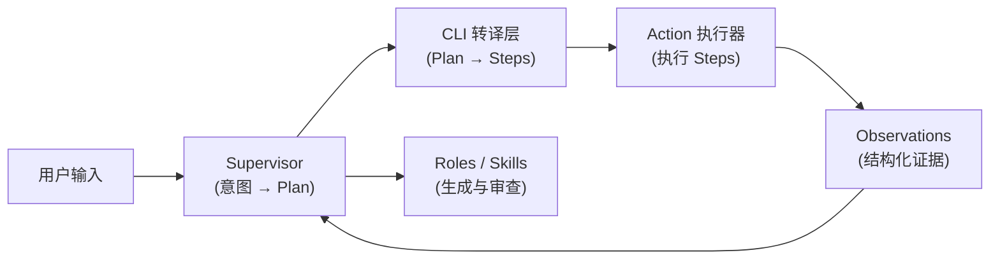

# UPower Design 3.3

**A Multi-Agent AI Team for Automated Design Engineering**

[English](#english) | [中文](#中文)

---

## ⚠️ Runtime Dependency & Evaluation Guide (评委体验必读)

### English
**UPower Design runs on Trae IDE and OpenCode.**
The multi-agent workflow, `Skill` orchestration, and `.trae/rules` auto-injection rely on IDE-native agent capabilities.
- **Full Experience (Trae / OpenCode):** Open this project in **Trae IDE** or **OpenCode** to experience the complete Agent team.
- **Other IDEs (Cursor / VS Code):** You can still experience UPower's core value — **"Evidence Chain"**. Point your IDE's AI to the `Source/` directory to read the structured offline assets (`brand_dna.md`, `system_prompt.md`) as high-quality context for coding.

### 中文
**UPower Design 支持 Trae IDE 和 OpenCode。**
多智能体协作、`Skill` 调度和 `.trae/rules` 规则注入依赖 IDE 原生 Agent 能力。
- **完整体验（推荐 Trae / OpenCode）：** 使用 **Trae IDE** 或 **OpenCode** 打开本项目即可唤醒团队。
- **其他 IDE（Cursor / VS Code）：** 可体验 UPower 的核心价值——**"资产证据链"**。让 AI 读取 `Source/` 目录下的结构化文档作为高质量上下文辅助编码。

---

## English

This repository contains the configuration and workflow logic for **UPower Design 3.3** — an AI-native meta-framework that turns abstract ideas into production-ready frontend code through a structured multi-agent pipeline with quality assurance built in.

## What's New in v3.1

| Change | Impact |
|---|---|
| **Agent = Persona + Skill Group** | Roles focus on decisions & style; procedural details moved to Action layer |
| **Structured Plan → Steps pipeline** | Supervisor generates Plan(JSON), CLI layer translates to Steps(JSON) — reproducible & auditable |
| **Stop Conditions** | Ambiguous input triggers mandatory user clarification — no more guessing |
| **Automated Reviewer** | Visual + Interaction quality checks run after every build |
| **GUI Cockpit spec** | Real-time visibility into phase, artifacts, evidence, and risks |

## 0. Architecture (v3.1)



**Key Principle**: Supervisor is the only brain. Roles produce content but don't route tools. Action layer executes but doesn't decide.

## 1. Function Types

| Type | Trigger | Output |
|---|---|---|
| `init` | "New project XXX" | Project skeleton |
| `define` | "Write PRD", "Generate Brand DNA" | PRD + Brand DNA |
| `design` | "Generate design assets" | Style / Specs / Motion / Skeleton / Payload |
| `assemble` | "Assemble system prompt" | system_prompt.md |
| `build` | "Start coding" | React application |
| `audit` | "Review quality" | Reviewer report |

**Dependency**: `init → define → design → assemble → build → audit`

## 2. Squad Roster

| Role | Name | Focus Area |
|---|---|---|
| Project Manager | Atlas | Orchestration, Plan generation, State management |
| Product Designer | Alice | Strategy, PRD, Brand DNA, Experience goals |
| Visual Designer | Bob | Aesthetics, Style, Motion, MCP Bridge (Figma + Image Gen) |
| UX Architect | Mia | Structure, Wireframes, Information architecture |
| System Architect | Neo | Tech Stack, Data Models, Tokens |
| Growth Ops | Tina | Copywriting, Marketing ROI |
| Frontend Dev | Ken | React, Tailwind, Code implementation |
| Auditor | Judge | Visual + Interaction quality review |
| Historian | Scribe | Documentation & Knowledge retrieval |
| Internet Access | AR (Agent Reach) | Web/GitHub/Video/Weibo retrieval (optional) |

## 3. Getting Started

### Quick Start
```
1. /new <ProjectName>           → init: create project skeleton
2. Describe your product        → define-prd: generate PRD + Brand DNA
3. (auto)                       → define-wireframe: Mia + Bob generate wireframe
4. Review & approve wireframe   → user confirms before proceeding
5. "Generate design assets"     → design: 5 design asset files
6. "Assemble system prompt"     → assemble: compile system_prompt.md
7. /build                       → build: generate React application
8. (auto)                       → audit: Visual + Interaction review
```

### Detailed Flow
1. **Init**: `/new <ProjectName>` creates `Source/<ProjectName>/`
2. **Define**: Provide product description → Alice generates `prd(input).md` (follows `kb_prd_template.md`) + `brand_dna.md`
3. **Design**: Generate assets via pipeline:
   - `style_prompt.md`, `design_system_specs.md`, `animation_prompts.md`, `skeleton_template.json`, `web_content.js`
4. **Assemble**: Compile all assets into `system_prompt.md`
5. **Build**: Generate React + TypeScript + Tailwind application in `projects/<ProjectName>/`
6. **Audit**: Auto-run Visual & Interaction Reviewer → structured report

## 4. Key Specifications

### 4.1 Plan Schema
Supervisor outputs structured Plan objects:
```json
{
  "plan_id": "plan_20260416_abc123",
  "type": "define",
  "project_name": "MyProject",
  "expected_output": { "files": [...], "status": "defined" },
  "stop_conditions": [...]
}
```
See: `.trae/rules/plan_schema.md`

### 4.2 Responsibility Boundaries
| Layer | Responsibility | Does NOT |
|---|---|---|
| **Persona** | Decisions, style, stop conditions | Manage paths, run scripts |
| **Action/CLI** | Execute tools, resolve paths | Make business decisions |
| **Supervisor** | Intent → Plan, error handling | Execute tools directly |

See: `.trae/rules/responsibility_boundaries.md`

### 4.3 Quality Assurance
- **PRD Completeness**: `validate_prd_completeness` checks P0 fields before downstream
- **Visual Reviewer**: 14 rules (contrast, spacing, hierarchy, responsiveness)
- **Interaction Reviewer**: 14 rules (keyboard, forms, feedback, accessibility)
- **Bad Patterns**: Common anti-patterns library for prevention

See: `.trae/knowledgebase/file_template/kb_reviewer_checklist_*.md`

## 5. Project Structure

```
.trae/
├── rules/                          # Highest priority constraints
│   ├── responsibility_boundaries.md    # Persona vs Action layer
│   ├── function_types.md               # 6 function types
│   ├── plan_schema.md                  # Plan JSON Schema v0
│   ├── cli_translator.md              # Steps Schema + mappings
│   ├── supervisor_protocol.md          # Permission constraints
│   ├── cockpit_state_fields.md         # GUI state definition
│   ├── cockpit_wireframe.md            # GUI layout spec
│   ├── agent_state_machine.md          # Agent state transitions
│   └── reviewer_integration.md         # Quality check pipeline
├── skills/                         # Agent personas
│   ├── product-designer/SKILL.md       # Alice v3.3
│   ├── visual-designer/SKILL.md        # Bob
│   ├── frontend-engineer/SKILL.md      # Ken
│   └── ...
├── knowledgebase/                  # Reference materials
│   ├── file_template/
│   │   ├── kb_prd_template.md              # Executable PRD template
│   │   ├── kb_prd_gold_standard_example.md # Gold Standard PRD
│   │   ├── kb_prd_stop_conditions.md       # PRD completeness criteria
│   │   ├── kb_tokens_schema.md             # Design Tokens structure
│   │   ├── kb_design_bad_patterns_common.md    # Common anti-patterns
│   │   ├── kb_reviewer_checklist_visual_common.md      # Visual rules
│   │   └── kb_reviewer_checklist_interaction_common.md # Interaction rules
│   ├── kb_common_assets_maintenance_guide.md   # Maintenance guide
│   └── v31_demo_evidence_moments.md            # Demo evidence
└── JOURNAL.md                      # Demo flow record
```

## 6. External Integrations

- **agent-reach** (optional): Internet access helper (Web/GitHub/Video/Weibo)
- **MCP** (via Bob): Figma layout/content extraction, image download, generative image assets
- **skill-creator**: All skill modifications must be reviewed by skill-creator

## 7. Maintaining Common Assets

Common design assets (bad patterns, reviewer checklists, tokens schema) are shared across projects.

| Action | How |
|---|---|
| **Add** | Record issue in team retro → add to common file → PR review |
| **Modify** | Confirm necessity → team discussion → update + notify |
| **Remove** | Mark as deprecated → keep removal record → team sign-off |

**Review frequency**: Quarterly or after major project completion.

See: `.trae/knowledgebase/kb_common_assets_maintenance_guide.md`

---

# Changelog

## v3.1 - Structured Pipeline & Quality Assurance (Current)
- **Architecture**: Supervisor → CLI Translator → Action Runner pipeline (Plan/Steps/Observations)
- **Persona Optimization**: Alice PoC — stripped procedural details, added Decision Heuristics + Stop Conditions + Functional API
- **PRD System**: Executable PRD template with completeness validation, Gold Standard example, multi-terminal appendixes (Web/Mobile/Landing/Desktop)
- **Quality Layer**: Design Tokens schema, Bad Patterns library (common + project), Visual & Interaction Reviewer Checklists (28 rules), automated review integration
- **GUI Cockpit**: State fields definition, wireframe (Left Chat / Right Canvas), agent state machine (7 states)
- **Demo**: End-to-end flow documentation with 5 evidence moments

## v2.3 - Skill Spec Standardization
- Standardized skill frontmatter with trigger context + verifiable outputs
- Added Success Criteria sections across core skills
- Refreshed packaging rules

## v2.2 - Open Source Packaging
- Bilingual README, MCP bridge clarification, release packaging template

## v2.1 - Lab-Clean & Precision
- Tone pivot to Lab-Clean Brutalism, `/hero` command

## v2.0 - UPower Command Center
- Unified Concierge + Builder command protocol, MCP integration

---

## 中文

本仓库包含 **UPower Design 3.3** 的配置与工作流逻辑：用一支"模拟的多 Agent 团队"，把抽象需求转成可交付的前端页面，并在过程中留下可追溯的结构化证据链。

## v3.1 核心变化

| 变化 | 影响 |
|---|---|
| **Agent = Persona + Skill Group** | 角色专注决策与风格；流程细节归 Action 层 |
| **结构化 Plan → Steps 管线** | Supervisor 生成 Plan(JSON)，CLI 层转译为 Steps(JSON)——可回放、可审计 |
| **Stop Conditions** | 模糊输入触发强制追问——禁止猜测执行 |
| **自动 Reviewer** | 每次构建后自动运行 Visual + Interaction 质检 |
| **GUI Cockpit 规范** | 实时可见：阶段、产物、证据、风险 |

## 0. 架构（v3.1）



**核心原则**：Supervisor 是唯一大脑。角色只生成内容，不路由工具。Action 层只执行，不决策。

## 1. 功能类型

| 类型 | 触发 | 产出 |
|---|---|---|
| `init` | "新建项目 XXX" | 项目骨架 |
| `define` | "写 PRD"、"生成 Brand DNA" | PRD + Brand DNA |
| `design` | "生成设计资产" | Style / Specs / Motion / Skeleton / Payload |
| `assemble` | "组装 system prompt" | system_prompt.md |
| `build` | "开始构建" | React 应用 |
| `audit` | "检查质量" | Reviewer 报告 |

## 2. 团队角色

- **Atlas**：编排与状态管理（Supervisor）
- **Alice**：策略 / PRD / Brand DNA / 体验目标
- **Bob**：视觉 / 动效，支持 MCP 接入（Figma + 生图）
- **Mia**：信息架构 / 线框
- **Ken**：React + Tailwind 落地实现
- **Judge**：Visual + Interaction 质量审核
- **Tina**：文案 / 增长 / 传播 ROI
- **Scribe**：里程碑记录与知识沉淀
- **AR**（可选）：agent-reach 外部信息检索

## 3. 快速开始

```
1. /new <ProjectName>           → 初始化项目骨架
2. 描述你的产品                  → 生成 PRD + Brand DNA
3. (自动)                       → Mia + Bob 协作生成 wireframe
4. 确认 wireframe                → 用户 approve 后才进入设计阶段
5. "生成设计资产"                → 5 个设计资产文件
6. "组装 system prompt"         → 编译 system_prompt.md
7. /build                       → 生成 React 应用
8. (自动)                       → Visual + Interaction 审核
```

## 4. 质量保障

- **PRD 完备性验证**：必填字段检查 + 追问优先级
- **Visual Reviewer**：14 条规则（对比度、间距、层级、响应式）
- **Interaction Reviewer**：14 条规则（键盘、表单、反馈、可访问性）
- **反例库**：通识 + 项目特定坏例

## 5. 通识资产维护

通识设计资产（反例库、Reviewer Checklist、Tokens Schema）跨项目共享。

| 操作 | 流程 |
|---|---|
| **新增** | 团队复盘发现问题 → 添加到通识文件 → PR 审核 |
| **修改** | 确认必要性 → 团队讨论 → 更新 + 通知 |
| **移除** | 标记废弃 → 保留移除记录 → 团队签字 |

**Review 频率**：每季度或重大项目结束后。

详见：`.trae/knowledgebase/kb_common_assets_maintenance_guide.md`
